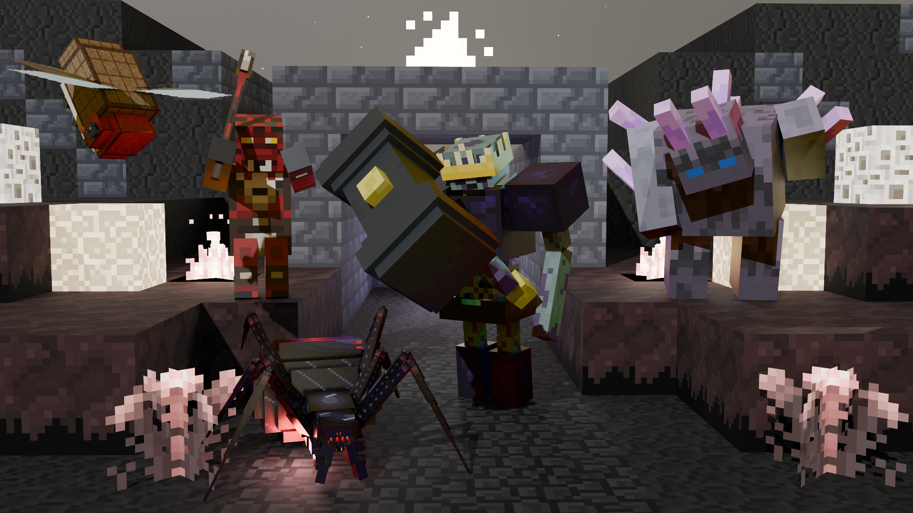

# X Mobs (`x_mobs`)

[](https://content.luanti.org/packages/SaKeL/x_mobs/)
[](https://content.luanti.org/packages/SaKeL/x_mobs/)

[](LICENSE.txt)
[](LICENSE.txt)




High-performance mobs and boss framework for Luanti featuring original 3D models with glTF 2.0 multi-track skeletal animations, multi-phase combat mechanics, and dynamic entity visual controls.

## Features

- **glTF 2.0 Multi-Track Animations**: Custom-authored 3D models with named animation tracks optimized for Luanti 5.17.0+ skeletal playback, following Unreal Engine Mannequin animation and movement principles (anticipation, weight shift, secondary wave lag, and momentum follow-through).
- **Nether Arachnid (Spider Mob)**: A predatory multi-legged arachnid mob featuring 23-bone dual-jointed skeletal rigging (Femur Upper + Tibia Lower), articulated fangs and pedipalps, an alternating tetrapod gait walk and run cycle, wall and ceiling climbing with surprise ceiling ambush drops, long-range pounce leaps, ranged web silk sprays, venomous fang strikes, tactical low-health retreat regeneration, swarm alerting, and an iconic arachnid death curl animation where all 8 legs contract inward.
- **Fallen Shaman & Minions**: Cunning cultist sorcerer that maintains standoff distance to hurl explosive fireball projectiles while summoning up to 3 Fallen Minions directly between itself and players as an interposing meat-shield.
- **Skull Legion**: Undead skeletal forces featuring the high-poise Skull King boss, aggressive Skull Lancers, and sharpshooting Skull Archers with directional bone aiming, arrow projectiles, soul essence healing, and bone dust VFX.
- **Crystal Guardian & Minions**: Ancient towering crystalline golem with dense basalt and amethyst armor (`fleshy = 50, cracky = 70`), high health pool (140 HP), passive regenerative crystal core, stalwart persistence (never flees), bonded pair combat coordination, and a seismic Ground Smash AoE attack (20% chance) featuring plane-attracted shockwave particles, flying basalt debris, terrain debris mapping (ice chunks on ice, stone particles on stone), and directional player knockback across a 5-block radius. Pickaxes exploit its targeted crystalline weak point (`cracky = 70`), dealing heightened armor-piercing damage compared to deflected slashing blades (`fleshy = 50`). Supported by player-scale **Crystal Guardian Minions** (`x_mobs:crystal_guardian_minion`, 70 HP, `fleshy = 75, cracky = 85`, 3 damage) that rally in squads around the guardian and unleash localized shockwaves.
- **Golem & Minions**: Ancient colossal stone titan (160 HP) defending subterranean caverns, mountain peaks, and rocky crags. Features heavy basalt armor (`fleshy = 40, cracky = 90`), near-total knockback resistance (`knockback_mult = 0.1`), 8 clean canonical glTF 2.0 animation tracks (`idle`, `walk`, `run`, `punch2`, `punch`, `shoot`, `hurt`, `death`), swift martial cross-punches (`punch2`), a seismic ground smash (20% chance, `punch`) unleashing expanding planar shockwaves with kinetic player lift and terrain-mapped debris, a defensive hit reaction (`hurt`) where its left arm and stone fist raise in front of its face to cover from blows, and a signature two-stage dynamic boulder projectile attack (`shoot`) utilizing Luanti's `visual = "node"` rendering where a boulder dynamically extracts and levitates vertically from the ground before launching with aim-prediction ballistics and continuous world x/z tumbling rotation. Supported by player-scale **Golem Minions** (`x_mobs:golem_minion`, 80 HP, `fleshy = 70, cracky = 95`, 3 damage) that accompany the titan, hurl smaller ground-extracted boulders (`x_mobs:golem_minion_boulder`), and perform coordinated tactical melee.
- **Nature Guardian**: Colossal ancient timber golem (120 HP) defending sacred groves and old-growth canopies. Features 5 seasonal autumn bark variations via native Luanti HSL texture modifiers, open-sky sunlight photosynthesis regeneration, devastating melee combos alternating swift punches and heavy shockwave slams, all 10 glTF 2.0 animation tracks (`idle`, `stand`, `walk`, `run`, `punch`, `attack`, `cast`, `spell`, `death`, `die`), and an Entangling Roots spell that immobilizes intruders at mid-range (6–16 blocks) by erupting gnarled roots from the ground utilizing the core envelop visual subsystem and zeroing movement speed and jump.
- **Armored Bug**: Autonomous 3D flocking flyers utilizing the high-performance Swarm Intelligence subsystem with Boids repulsion, dynamic waypoint following, high-frequency wing oscillation, and coordinated hive mind attacks.
- **Flying Insect**: Fragile airborne swarm insect featuring unarmored carapace (`fleshy = 100`), lower health (24 HP) and attack damage, multi-track glTF animations (`idle`, `stand`, `walk`, `run`, `attack`, `death`), custom pixel-art particles for organic carapace, gossamer wings, and hemolymph, and native Luanti HSL texture modifiers (`^[hsl:`) creating rich brown phenotype color variations across swarms.
- **Skeleton Swordfish**: Undead pelagic predator mob utilizing `x_mob_core`'s fish schooling architecture with Leader-Follower Anchor Steering, 3D obstacle and boundary avoidance, multi-track glTF animations (`stand`, `idle`, `walk`, `run`, `attack`, `death`), zero-drift anatomical keyframe pivots, and democratic leader succession. Spawns naturally in oceanic waters while strictly excluding river systems.
- **Crazy Mushroom (Boss)**: A cunning fungal boss mob that commands a vanguard of 3 Fungus Minions. Features glTF 2.0 multi-track animations (`stand`, `walk`, `run`, `shoot`, `punch`, `death`), spore ball projectile attacks at mid-range, unarmored vulnerability (`fleshy = 90`), tactical kiting with slower retreat speed than players (`walk_speed = 3.0`, `retreat_speed = 2.8`), instant transition to a rapid cross-punch melee combo when players catch up within 3 blocks, and tactical retreat behind its minion vanguard to regenerate health when below 30% HP.
- **Fungus Minion**: Fast and aggressive fungal swarmers (`pursuit_speed = 5.2`) that serve as loyal shock-troops to the Crazy Mushroom boss. Features glTF 2.0 multi-track animations (`stand`, `walk`, `run`, `punch`, `death`), lunging punch attacks, and tight squad coordination rallying to protect the boss.
- **Dynamic Particle Systems**: Advanced particle effects using modern Luanti particle APIs (texpools, drag, jitter, bounce, scale/alpha tweens, plane attractors, line attractors, and glow) for venom droplets, web silk wisps, bone dust, crystal shards, and skittering dust.

---

## Mob Mechanics & How to Play

X Mobs introduces a variety of dynamic creatures and challenging bosses to your world. Each mob is designed with unique behaviors, combat phases, and visual effects to provide an immersive gameplay experience.

- **Nether Arachnid (Spider)**: An agile predator capable of traversing floors, walls, and ceilings seamlessly. Be cautious when exploring beneath dark cavern roofs—if a spider perches directly above you, it will execute a sudden **ceiling drop** plunge attack dealing heavy damage. From medium distance (4.5–10.5 blocks), it executes high-speed **pounce leaps** to close ground, or sprays dual pulses of **web silk** to strike from afar. In close quarters, it delivers venomous fang bites. If its health drops to 10 HP or lower, it tactically flees to regenerate up to 24 HP before returning to the hunt. Engaging a spider also alerts up to 3 nearby allies within 12 blocks.
- **Fallen Shaman & Minions**: A dangerous backline cultist caster that maintains a 8–14 block standoff distance to bombard players with high-speed fireball projectiles. When closed in on or damaged, the Shaman summons up to 3 Fallen Minions directly between itself and the player as an interposing meat-shield. Minions aggressively swarm targets with clubs and can climb or open doors, but panic and scatter if heavily damaged. If cornered in close quarters, the Shaman strikes with its staff.
- **Skull Legion**: A disciplined skeletal regiment led by the towering **Skull King** boss (120 HP). The King possesses high poise, door-opening ability, and heavy melee punch combos, commanding a bodyguard squad of fast **Skull Lancers** and sharpshooting **Skull Archers** firing custom arrows. Attacking the King prompts the entire squad to focus fire on the aggressor. If reduced below 25 HP, the King retreats to recover vitality with soul essence particles before resuming the assault.
- **Crystal Guardian & Minions**: An ancient golem (140 HP) with unyielding poise (immune to knockback) and passive crystal core regeneration that never flees. Its dense basalt armor heavily reduces slashing blade damage (`fleshy = 50`), but pickaxes exploit its crystalline structure (`cracky = 70`) to deal heavy armor-piercing damage accompanied by resonant fracture audio. It has a 20% chance to unleash a devastating **Ground Smash** AoE: charging crystal energy into its fist before slamming the floor, creating a 5-block shockwave that propels players upward and outward with heavy kinetic lift and sprays biome-mapped terrain debris. Supported by player-scale **Crystal Guardian Minions** (70 HP, `fleshy = 75, cracky = 85`, 3 damage, 1.8m height) providing close-quarters squad support.
- **Golem & Minions**: A monolithic titan (160 HP, 2.7m height) built of ancient living stone that guards solitary mountain peaks, subterranean caverns, and rocky chasms. Heavily resistant to swords and arrows (`fleshy = 40`), but vulnerable to heavy pickaxe strikes (`cracky = 90`). When close to the player (< 7.5 blocks), it strictly engages in close-quarters combat and pursuit with swift cross-punches (`punch2`) dealing 7 damage, and a 20% chance to execute a devastating **Ground Smash** (`punch`) dealing 8 damage across a 3.8-block radius with kinetic player lift and expanding terrain shockwaves. Only from distance (7.5–18 blocks) does it channel its 2-stage **Earth Extraction** attack (`shoot`): raising an authentic local ground block (`visual = "node"`) 2.4 blocks vertically from the terrain before hurling it with predictive aim ballistics, continuous x/z axis tumble rotation, and localized AoE splash. When damaged below 25% health (40 HP), it enters a tactical retreat sprint (`flee_speed = 3.8`), maintaining a safe standoff distance bounded at 14 blocks while continuing to pelt pursuers with boulders from distance; if cornered in close quarters while fleeing, it delivers desperation melee strikes before resuming retreat until its vitality regenerates above 70 HP. Accompanied by player-scale **Golem Minions** (80 HP, `fleshy = 70, cracky = 95`, 3 damage, 1.8m height) that hurl smaller ground-extracted boulders (4 damage) and guard their titan in squads.
- **Nature Guardian**: An ancient colossus (120 HP) that prowls in pairs through sacred forests, groves, and rainforest canopies. Displays 5 rich autumn bark phenotypes (`Amber`, `Crimson Maple`, `Golden Birch`, `Russet Oak`, `Withered Evergreen`) and passively regenerates vitality under open sky and direct sunlight (`light >= 12`). In close combat, it alternates between swift 5-damage punches and punishing 9-damage heavy shockwave slams. At mid-range (6–16 blocks), it channels an **Entangling Roots** spell: charging nature runes into its fists before slamming the ground, causing gnarled roots (`x_mob_core:envelop`) to erupt around the intruder's feet and completely immobilize them (`speed = 0`, `jump = 0`) for up to 6 seconds with nature particle pulses and ground-shatter audio upon expiration or removal.
- **Armored Bug & Flying Insect**: Autonomous airborne swarm predators that hover with rapid wing flutter. Armored Bugs feature reinforced chitin armor and aggressive pursuit, while Flying Insects are fast, fragile unarmored swarms (`fleshy = 100`) exhibiting 7 distinct natural color phenotypes through native Luanti HSL texture modifiers.
- **Skeleton Swordfish**: Undead pelagic predators that roam deep ocean waters in coordinated shoals using leader-follower anchor steering and democratic leader succession. When an intruder is detected, the shoal coordinates high-speed ramming charges.
- **Crazy Mushroom & Fungus Minions**: A tactical fungal boss encounter. The towering Crazy Mushroom boss stays at mid-range launching toxic spore ball projectiles with trailing spore clouds while its 3 agile Fungus Minions charge in. If players close distance within 3 blocks, the boss instantly shifts from ranged bombardment into a swift martial cross-punch melee combo. When dropped below 30% health, the boss retreats behind surviving minions to regenerate vitality.

### Spawning Mobs

Mobs naturally spawn in their respective biomes and environments based on their configured logic. For example, Spiders lurk in dark caverns and surface shadows, Crystal Guardians guard in pairs across deep caverns and crystal stone biomes, and Skeleton Swordfish school in oceanic depths (`group:water`).

## Modding & Custom Mobs

You can easily register your own mobs or modify existing ones using the `x_mob_core` API.

### Minimal Mob Definition Example

Here is a quick example of how to register a basic custom mob:

```lua
x_mob_core.register_mob("mymod:custom_mob", {
	initial_properties = {
		hp_max = 20,
		mesh = "mymod_mob.glb",
		textures = {
			"mymod_mob.png",
		},
		visual_size = {x = 1.0, y = 1.0},
		collisionbox = {-0.3, 0.0, -0.3, 0.3, 1.7, 0.3},
		stepheight = 0.6,
	},

	factions = { "monster" },
	armor_groups = { fleshy = 100 },
	damage = 3,
	attack_range = 2.0,
	walk_speed = 1.6,
	pursuit_speed = 3.2,
	wander_speed = 1.2,

	animations = {
		stand  = {track = "stand",  speed = 1.0, loop = true},
		walk   = {track = "walk",   speed = 1.0, loop = true},
		run    = {track = "run",    speed = 1.2, loop = true},
		attack = {track = "attack", speed = 1.0, loop = false},
		death  = {track = "death",  speed = 1.0, loop = false},
	},

	drops = {
		{ name = "default:bone", min = 1, max = 2, chance = 0.8 },
	},
})
```

### Spawning Your Mob

To spawn your custom mob in the world naturally, use the spawn registry:

```lua
x_mob_core.register_spawn("mymod:custom_mob", {
	nodes = {"group:stone", "group:soil"},
	min_light = 0,
	max_light = 7,
	chance = 3500,
	active_object_count = 2,
	min_elevation = -50,
	max_elevation = 100,
})
```

## Detailed Developer API

For extensive technical details on advanced mob mechanics, skeletal animations, particle systems, shoaling/flocking architecture, and multi-phase combat logic, please refer to the **[x_mob_core framework documentation](https://github.com/sakel-hub/x_mob_core)**.

---

## License

- Code: MIT (see [LICENSE.txt](LICENSE.txt))
- 3D Models & Animations: MIT (converted/reworked models derived from DuckGo) & CC-BY-4.0 (original models by SaKeL; see [LICENSE.txt](LICENSE.txt))
- Textures: CC BY-SA 4.0 (DuckGo) & CC-BY-4.0 (original textures and VFX particle sheets by SaKeL; see [LICENSE.txt](LICENSE.txt))
- Audio: CC0 1.0 Universal, CC-BY-4.0, & MIT (see [LICENSE.txt](LICENSE.txt))

